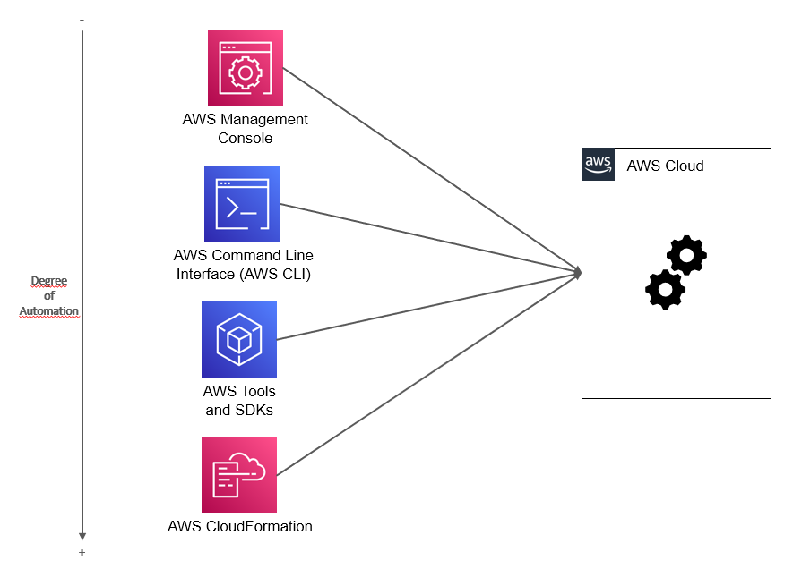

# Chapter 19 &mdash; Interacting with Amazon Web Services
## Section 1: Intro to AWS
> TBD

### Summary
+ Overview of AWS
+ Cloud: types and service categorization
+ Benefits of AWS

### Intro
*Amazon Web Services (AWS)* is a platform of web services that oggers solutions for computing, storing, and networking at different levels of abstraction. These web services are available through the public internet using standard protocols such as HTTP.

In more general terms, AWS is known as a public cloud computing platform:
> Cloud computing is a model for enabling ubiquitous, convenient, on-demand network access to a shared pool of configurable computing resources (such as networks, vms, storage, applications, and services) that can be rapidly provisioned and released with minimal management effort or service provider interaction.

Clouds can be classified as:
+ *public* &mdash; a cloud managed by an organization and open to use by the general public
+ *private* &mdash; a cloud that virtualizes and distributes the IT infrastructure for a single organization
+ *hybrid* &mdash; a mixture of a public and private cloud

The cloud computing services can be classified according to the level of abstraction they provide:
+ *IaaS* &mdash; provides fundamental resources like computing, storage, and networking capabilities.
+ *PaaS* &mdash; provides platforms on which you can deploy custom applications to the cloud.
+ *SaaS* &mdash; combines infrastructure and software running in the cloud.

### Benefits of AWS

+ Innovative and fast-growing platform
+ Wide range of services that solve common problems
+ Automation baked into the platform
+ Scalability and reliability
+ Reduced time to market
+ Economies of scale
+ Huge global infrastructure
+ Pay-per-use

### Ways to interact with AWS

The following diagram depicts the different ways you can use to interact with AWS:

### You know you've mastered this section when...

+ You are comfortable describing AWS as a public cloud
+ You understand the different types of clouds and their service categorization according to the abstraction level they provide
+ You understand the benefits of using AWS (or any cloud provider for that matter)
+ You are aware of the different options available to access and interact with AWS
